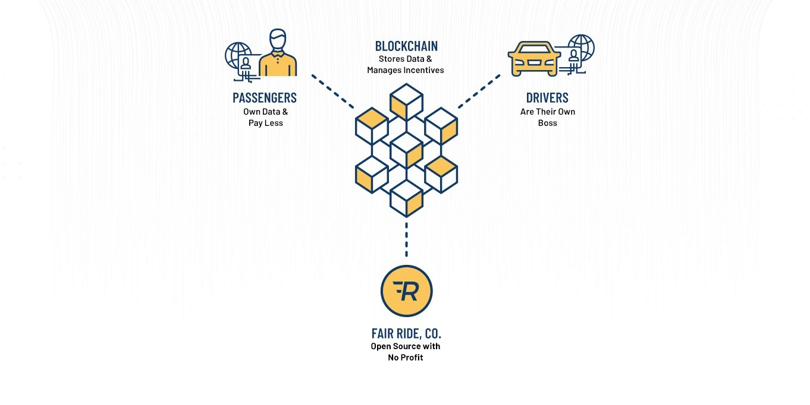

# A blockchain-based network to reduce the travel cost in the Ride-Sharing service
ارائه یک شبکه مبتنی بر بلاکچین برای کاهش هزینه سفر در سرویس اشتراک گذاری سفر

By Mehran Mazhar 
MohammadHossein ShafiAbadi, Ph.D. - Thesis Advisor

-Current Ride-Share model

-Blockchain-based Ride-Share model
 
